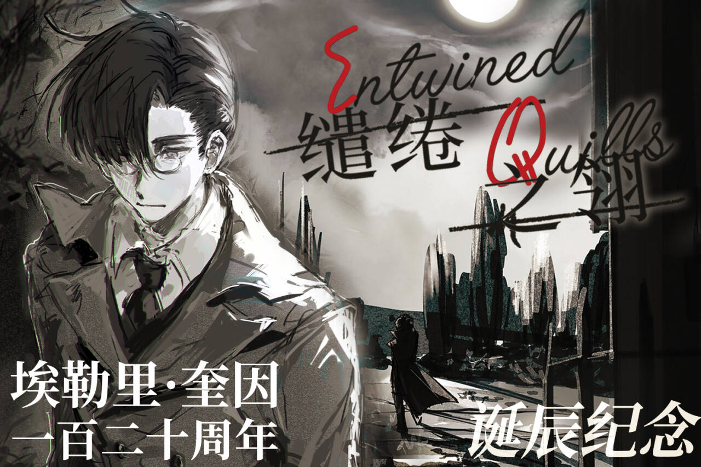

<p align="center">
  <a href="README.md">English</a> |
  <strong>简体中文</strong> |
  <a href="README.ja.md">日本語</a>
</p>

<h1 align="center">缱绻之翎</h1>

<p align="center">
  <em>埃勒里·奎因诞辰 120 周年纪念同人志</em><br>
  由中国埃勒里·奎因爱好者共同创作的纪念企划。
</p>

<p align="center">
  <a href="https://github.com/FugeCantabile/Entwined-Quills/releases/latest"></a>
  <a href="LICENSE"></a>
  <a href="https://github.com/FugeCantabile/Entwined-Quills/stargazers"></a>
</p>

---

## 项目简介

**《缱绻之翎》（Entwined Quills）** 是为纪念 **埃勒里·奎因诞辰 120 周年**而创作的特别企划。

我们将自行制作的数字版公开分享，希望能让更多读者接触并欣赏这部作品。

我们也欢迎其他语言的译本，诚挚欢迎译者通过 Pull Request 提交自己的翻译成果。

## 宣传素材

### 海报



### 宣传视频

https://github.com/user-attachments/assets/2a72cb93-78a5-4cc7-863a-19984768d463

## 内容简介

这部同人志汇集了小说、评论、译文、问答资料和参考年表。

### 第一卷

由中国埃勒里·奎因爱好者创作的七篇致敬小说。

### 第二卷

- 中国爱好者撰写的埃勒里·奎因评论文章
- 日本及美国评论文章的中文译文
- 问答栏目

### 特别参考部分

同人志末尾收录了我们编制的三份年表：

1. 两位作者的创作生涯年表
2. 作品出版日期年表
3. 埃勒里·奎因与哲瑞·雷恩所侦破案件的可能时间顺序

这些年表参考了诸多不同来源编制而成。

## 插图

同人志收录了十八幅插图，再现埃勒里·奎因小说中的经典场景。

## 书名由来

我们为这部同人志取名 **“Entwined Quills”**（中文名：**《缱绻之翎》**）。

- 英文名缩写为 **EQ**，直接呼应 Ellery Queen
- 封面书名中的字母 **Q**
- 交缠的羽毛意象象征双人创作、协作与创造

确定书名后，我们惊喜地发现，就像 EQ 最喜爱的文字游戏之一那样，**“Entwined Quills”** 的字母可以重新排列为：

> **Queen still wind**

中文名为 **缱绻之翎**  
拼音：**Qiǎnquǎn Zhī Líng**

这个中文名取其古典、雅致的语调和文学意蕴。

## 读者反馈

如果你已经读完这部同人志并愿意分享感想，无论长篇书评还是简短评论，我们都由衷欢迎。

- 欢迎在 [Issues](https://github.com/FugeCantabile/Entwined-Quills/issues) 中发布读后感
- 如果你在其他平台发表了评论，也欢迎在 Issue 中分享文章链接

我们非常期待读到你的感想。

### 如何提交评论 Issue

如果你使用 GitHub CLI：

```bash
# 1. 如有需要，Fork 或克隆本仓库
git clone https://github.com/FugeCantabile/Entwined-Quills.git
cd Entwined-Quills

# 2. 登录 GitHub CLI
gh auth login

# 3. 创建 Issue，提交短评或长篇书评
gh issue create \
  --title "My reading notes on Entwined Quills" \
  --body "I have finished reading the fanzine. Here are my comments..."
```

如果你想分享站外书评链接：

```bash
gh issue create \
  --title "Review link: [your review title]" \
  --body "I published my review here: https://example.com/your-review"
```

## 翻译贡献

**如果你有兴趣翻译本项目，我们非常欢迎你的贡献。**

我们尤其欢迎：

- 英文翻译
- 日文翻译
- 其他语言翻译

请注意，本仓库主要用于托管已经发布的数字版本。翻译成果应作为附加文件提交，请勿替换原版文件。

### 如何提交翻译 Pull Request

如果你希望贡献翻译，推荐采用以下流程：

```bash
# 1. 在 GitHub 上 Fork 本仓库，然后克隆你的 Fork
git clone https://github.com/YOUR_USERNAME/Entwined-Quills.git
cd Entwined-Quills

# 2. 将原仓库添加为 upstream
git remote add upstream https://github.com/FugeCantabile/Entwined-Quills.git

# 3. 创建翻译分支
git checkout -b translation/en-readme

# 4. 添加翻译文件
# 示例：
# README.en.md

# 5. 暂存并提交你的工作
git add README.en.md
git commit -m "Add English translation of README"

# 6. 将分支推送到你的 Fork
git push origin translation/en-readme

# 7. 使用 GitHub CLI 创建 Pull Request
gh pr create \
  --repo FugeCantabile/Entwined-Quills \
  --base main \
  --head YOUR_USERNAME:translation/en-readme \
  --title "Add English translation of README" \
  --body "This PR adds an English translation of README.md."
```

即使不使用 GitHub CLI，你仍可完成相同的 Git 操作，然后在 GitHub 网页中创建 Pull Request。

我们会尽快审阅并处理贡献。

## 许可协议

本项目采用 [CC-BY-NC-SA 4.0](https://creativecommons.org/licenses/by-nc-sa/4.0/) 许可协议。

- **署名（BY）：** 必须以适当方式标明原作者
- **非商业性使用（NC）：** 不得将本材料用于商业目的
- **相同方式共享（SA）：** 若对本材料进行再混合、转换或再创作，必须以相同许可协议发布贡献内容

---

**Entwined Quills = Queen still wind**
